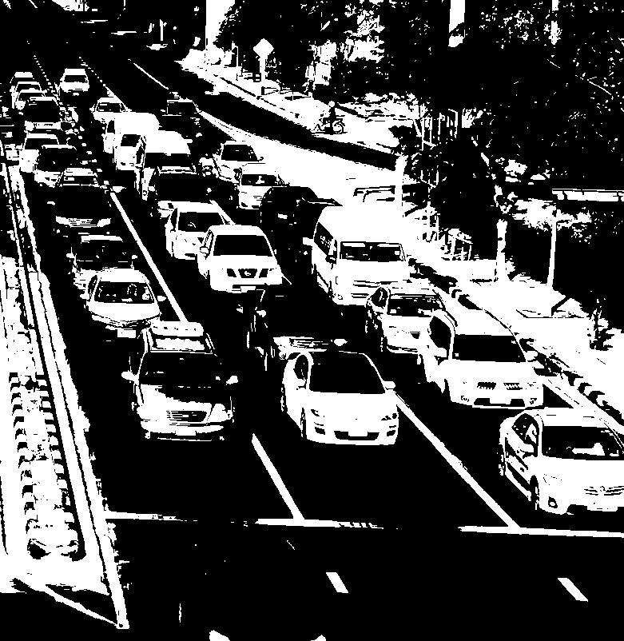

# Adaptive Traffic Filtering with Number Plate Recognition
## Neelabhro Roy & Munish Thakral
## INTRODUCTION
The ever growing number of vehicles on roads, has been a problem in India since a long time. To add to the woes, the Traffic Lights here, are pre timed, not taking into account the Ground Zero conditions no matter how many vehicles there are on a particular street. Hence, we plan to design a complete Adaptive Traffic Light Filtering system, which would assess the situations in real time, and allot time to a certain signal in accordance with the number of vehicles waiting before it, using Image Acquisition and Image Processing techniques. Moreover, we plan to inculcate an algorithm in our design, to detect the Number Plates of the defaulting vehicles which jump Red Lights, and store them for future prosecution.

## OBJECTIVES
- Collection of Training Data ( with visible Vehicular congestion) for our Algorithms, which would involve detection of Vehicular Clusters standing before the defaulting marks of Red Light
- Algorithm for Number Plate detection of defaulting vehicles through Image Retargeting.
- Algorithm for efficient and Adaptive Time Allotment to traffic signals in accordance with the vehicular congestion before the signal.

## How Adaptive Traffic Filtering works
The following image processing algorithms are followed, and the resultant image is as shown below:
1. Input Image
2. Grayscale and Binary Conversion
3. Adaptive Background Subtraction
4. Histogram Equalisation
5. Thresholding
6. Edge Detection using Sobel
7. Cleaning up the Image Borders
8. Image Dilation
9. Density Calculations

### Bckground image for clean subtraction is:

### Binarized Image after operations is:

### Final Output Image for density calculations is:

## How the Car Number Plate Detection and Recognition Algorithm works
1. Taking Image Input
2. Binarize the Input Image
3. Thresholding
4. Edge Detection (Taking into account that the column with the most number of Black Pixels is the edge in the Input Image)
5. Removal of detected edges from the image by cropping
6. Character Detection using Point Detection ( As soon as a Black Pixel arrives while itirating, it indiactes that a character has been detected and column wise scanning starts.)
7. Edge detection (We then move on to detect a completely white column to mark the end of the character.)
8. Storage of array of Row Numbers where Black Pixels are obtained.
9. Obtaining Character width and ommitting characters with widths below a certain threshold to remove false positives.
10. Inverting the Dataset Imgages for Character recognition.
11. Resizing the dataset images to suit our character images.
12. Comparison of the 42x24 = 1008 pixels of the images using pixel to pixel mapping.(The character would have the maximum overlap with it's dataset image ideally)
13. Assigning Dataset image name/ number to the character.
14. Obtaining the final detected characters.

### Sample Dataset Image

### Obtained Sample Character

